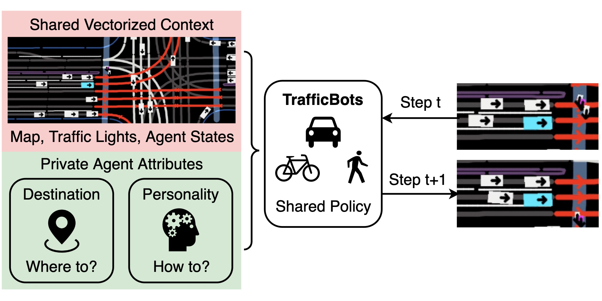

# TrafficBots

<p align="center">
     
     <br/>TrafficBots, a multi-agent policy that generates realistic behaviors for bot agents by learning from real-world data.
</p>

> **TrafficBots: Towards World Models for Autonomous Driving Simulation and Motion Prediction**            
> [Zhejun Zhang](https://zhejz.github.io/), [Alexander Liniger](https://alexliniger.github.io/), [Dengxin Dai](https://scholar.google.com/citations?user=T51W57YAAAAJ&hl=en), Fisher Yu and [Luc Van Gool](https://vision.ee.ethz.ch/people-details.OTAyMzM=.TGlzdC8zMjcxLC0xOTcxNDY1MTc4.html).<br/>
> 
> [ICRA 2023](https://ieeexplore.ieee.org/document/10161243)<br/>
> [Project Website with Videos](https://zhejz.github.io/trafficbots)<br/>
> [arXiv Paper](https://arxiv.org/abs/2303.04116)

```bibtex
@inproceedings{zhang2023trafficbots,
  title     = {{TrafficBots}: Towards World Models for Autonomous Driving Simulation and Motion Prediction},
  author    = {Zhang, Zhejun and Liniger, Alexander and Dai, Dengxin and Yu, Fisher and Van Gool, Luc},
  booktitle = {International Conference on Robotics and Automation (ICRA)},
  year = {2023}
}
```

## Setup Environment
- Create the [conda](https://docs.conda.io/en/latest/miniconda.html) environment by running `conda env create -f environment.yml`.
- Install [Waymo Open Dataset](https://github.com/waymo-research/waymo-open-dataset) API manually because the pip installation of version 1.5.2 is not supported on some linux, e.g. CentOS. Run 
  ```
  conda activate traffic_bots
  wget https://files.pythonhosted.org/packages/85/1d/4cdd31fc8e88c3d689a67978c41b28b6e242bd4fe6b080cf8c99663b77e4/waymo_open_dataset_tf_2_11_0-1.5.2-py3-none-manylinux_2_24_x86_64.manylinux_2_28_x86_64.whl
  mv waymo_open_dataset_tf_2_11_0-1.5.2-py3-none-manylinux_2_24_x86_64.manylinux_2_28_x86_64.whl waymo_open_dataset_tf_2_11_0-1.5.2-py3-none-any.whl
  pip install --no-deps waymo_open_dataset_tf_2_11_0-1.5.2-py3-none-any.whl
  rm waymo_open_dataset_tf_2_11_0-1.5.2-py3-none-any.whl
  ```
- We use [WandB](https://wandb.ai/) for logging. You can register an account for free.
- Be aware
  - We use 6 *NVIDIA RTX 2080Ti* for training and a single 2080Ti for evaluation. The training takes at least 5 days to converge.
  - This repo contains only the experiments for the [Waymo Motion Prediction Challenge](https://waymo.com/open/challenges/2023/motion-prediction/).
  - We cannot share pre-trained models according to the [terms](https://waymo.com/open/terms) of the Waymo Open Motion Dataset.


## Prepare Datasets
- Download the [Waymo Open Motion Dataset](https://waymo.com/open/data/motion/). We use v1.2.
- Run `python src/pack_h5_womd.py` or use [bash/pack_h5.sh](bash/pack_h5.sh) to pack the dataset into h5 files to accelerate data loading during the training and evaluation.
- You should pack three datasets: `training`, `validation` and `testing`. Packing the `training` dataset takes around 2 days. For `validation` and `testing` it takes a few hours. 

## Training, Validation and Testing
Please refer to [bash/train.sh](bash/train.sh) for the training.

Once the training converges, you can use the saved checkpoints (WandB artifacts) to do validation and testing, please refer to [bash/submission.sh](bash/submission.sh) for more details.

Once the validation/testing is finished, download the file `womd_joint_future_pred_K6.tar.gz` from WandB and submit to the [Waymo Motion Prediction Leaderboard](https://waymo.com/open/challenges/2023/motion-prediction/).

## Performance
Due to code refactoring, the performance now is slightly different than the numbers reported in the original paper.

| WOMD test  | Soft mAP | mAP   | Min ADE | Min FDE | Miss Rate | Overlap Rate |
| ---------- | -------- | ----- | ------- | ------- | --------- | ------------ |
| ICRA paper | 0.219    | 0.212 | 1.313   | 3.102   | 0.344     | 0.145        |
| Refactored | 0.199    | 0.192 | 1.319   | 3.046   | 0.380     | 0.157        |

The refactored version is less diverse than the original version, hence the higher miss rate and the lower (soft) mAP.
Since anyway the performance of TrafficBots is really poor on the Waymo Open Motion Prediction [leaderboard](https://waymo.com/open/challenges/2022/motion-prediction/), please do not spend too many efforts on improving it by tweaking the hyper-parameters or the architectures.
Nevertheless, if you find any bugs, please inform us by raising a GitHub issue.

There are mainly two reasons for the poor performance of TrafficBots compared to the motion prediction methods.
Firstly, to ensure scalability and efficiency TrafficBots uses the scene-centric representation, which is known to suffer from poor performance.
Secondly, training a closed-loop policy such as TrafficBots is always more difficult than training open-loop models.
Recently, we present a new network architecture called [HPTR](https://github.com/zhejz/HPTR) that addresses the first problem.
In fact, the repository is refactored because of [HPTR](https://github.com/zhejz/HPTR) and the new [Waymo Sim Agents Challenge](https://waymo.com/open/challenges/2023/sim-agents/).
We are working on the second problem and the sim agent challenge. Stay tuned and wait for our new publications!

## Ablation Models
Please refer to [docs/ablation_models.md](docs/ablation_models.md) for the configurations of ablation models.

Specifically you can find the [SimNet](https://arxiv.org/abs/2105.12332) and [TrafficSim](https://arxiv.org/abs/2101.06557) based on our backbone. You can also try out different positional encodings for the encoder, as well as different configurations for goal/destination, personality, and training strategies of the world model.

## License

This software is made available for non-commercial use under a creative commons [license](LICENSE). You can find a summary of the license [here](https://creativecommons.org/licenses/by-nc/4.0/).

## Acknowledgement

This work is funded by Toyota Motor Europe via the research project [TRACE-Zurich](https://trace.ethz.ch) (Toyota Research on Automated Cars Europe).